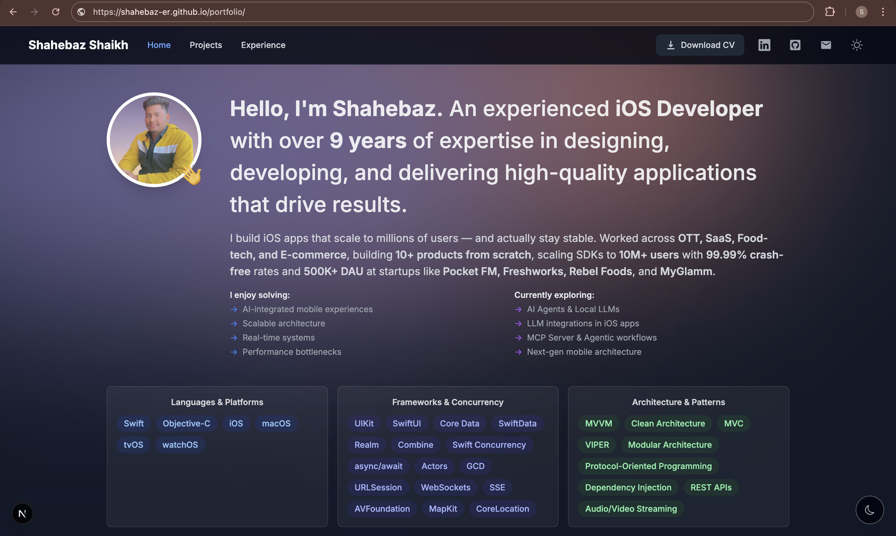
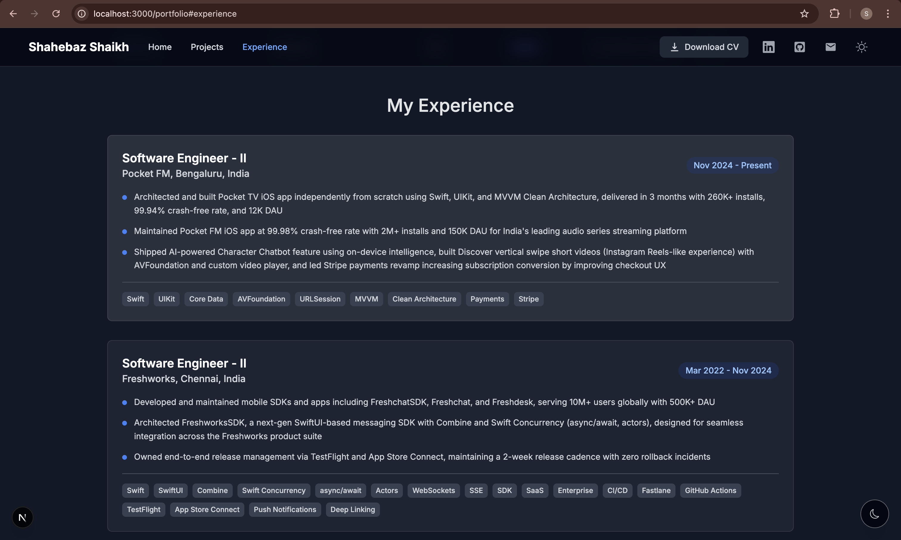

# Shahebaz Shaikh - Personal Portfolio Website

A modern, minimalistic, and responsive personal portfolio website built with **Next.js 16**, **TypeScript**, and **Tailwind CSS**. This project showcases my experience, projects, and skills as a Senior iOS Developer with 9+ years of experience across OTT, SaaS, Food-tech, and E-commerce domains.

**[Live Preview](https://shahebaz-er.github.io/portfolio/)**



## 🚀 Features

*   **Modern Tech Stack**: Built with Next.js 16 (App Router), TypeScript, and Tailwind CSS.
*   **Responsive Design**: Fully responsive layout that looks great on mobile, tablet, and desktop devices.
*   **Dark Mode**: Built-in dark/light mode toggle with system preference detection.
*   **Static Export**: Configured for GitHub Pages deployment with static HTML export.
*   **Type Safety**: Written in TypeScript for robust and maintainable code.
*   **Performance**: Optimized for speed and SEO using Next.js best practices.
*   **CI/CD**: Automatic deployment via GitHub Actions on every push to main.

## 🛠️ Tech Stack

*   **Framework**: [Next.js 16](https://nextjs.org/)
*   **Language**: [TypeScript](https://www.typescriptlang.org/)
*   **Styling**: [Tailwind CSS](https://tailwindcss.com/)
*   **Icons**: [React Icons](https://react-icons.github.io/react-icons/) & [Lucide React](https://lucide.dev/)
*   **Toast Notifications**: [React Hot Toast](https://react-hot-toast.com/)
*   **Deployment**: [GitHub Pages](https://pages.github.com/) with GitHub Actions
*   **Linting**: ESLint

## 📸 Screenshots

### Hero Section


### Experience Section


## 📂 Project Structure

```bash
portfolio/
├── app/                 # Next.js App Router pages and layout
├── components/          # Reusable UI components
├── context/             # React Context providers (Theme, ActiveSection)
├── lib/                 # Utility functions, types, and data
├── public/              # Static assets (images, CV, samples)
├── .github/workflows/   # GitHub Actions deployment workflow
└── ...config files      # Tailwind, Next.js, TypeScript configs
```

## ⚡️ Getting Started

Follow these steps to set up the project locally on your machine.

### Prerequisites

*   [Node.js](https://nodejs.org/) (v18 or higher)
*   [npm](https://www.npmjs.com/)

### Installation

1.  **Clone the repository:**

    ```bash
    git clone https://github.com/shahebaz-ER/portfolio.git
    cd portfolio
    ```

2.  **Install dependencies:**

    ```bash
    npm install --legacy-peer-deps
    ```

3.  **Run the development server:**

    ```bash
    npm run dev
    ```

    Open [http://localhost:3000/portfolio](http://localhost:3000/portfolio) with your browser to see the result.

## 📝 Customization

You can easily customize this portfolio with your own data:

1.  **Update Data**: Modify `lib/data.ts` to update your links, experience, projects, and skills.
2.  **Images**: Replace the images in the `public` folder with your own assets.
3.  **Personal Details**: Update the `components/intro.tsx` and other components to match your personal details.
4.  **CV**: Replace `public/Shahebaz-Shaikh-CV.pdf` with your own resume.

## 🚀 Deployment

This project is configured for **GitHub Pages** deployment using GitHub Actions.

### How it works:

1.  Push changes to the `main` branch.
2.  GitHub Actions automatically builds the static export (`npm run build`).
3.  The `/out` directory is deployed to GitHub Pages.
4.  Site is live at [https://shahebaz-er.github.io/portfolio/](https://shahebaz-er.github.io/portfolio/)

### Key configuration for GitHub Pages:

```js
// next.config.js
const nextConfig = {
  output: "export",
  basePath: "/portfolio",
  images: { unoptimized: true },
};
```

## 🤝 Contributing

Contributions are welcome! If you'd like to improve this project, please follow these steps:

1.  Fork the repository.
2.  Create a new branch (`git checkout -b feature/YourFeature`).
3.  Commit your changes (`git commit -m 'Add some feature'`).
4.  Push to the branch (`git push origin feature/YourFeature`).
5.  Open a Pull Request.

## 📄 License

This project is open source and available under the [MIT License](LICENSE).
